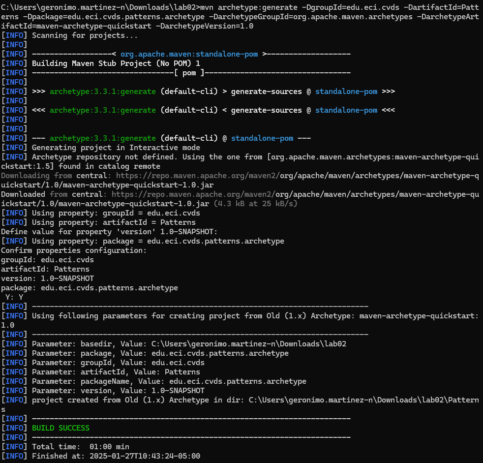
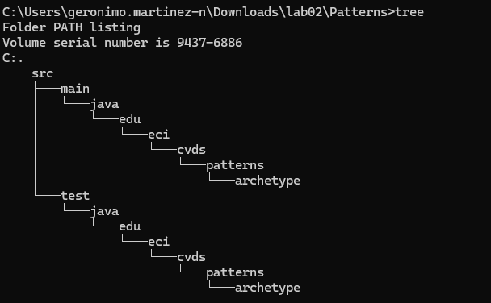
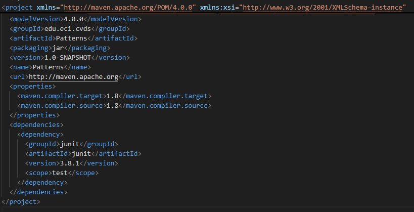
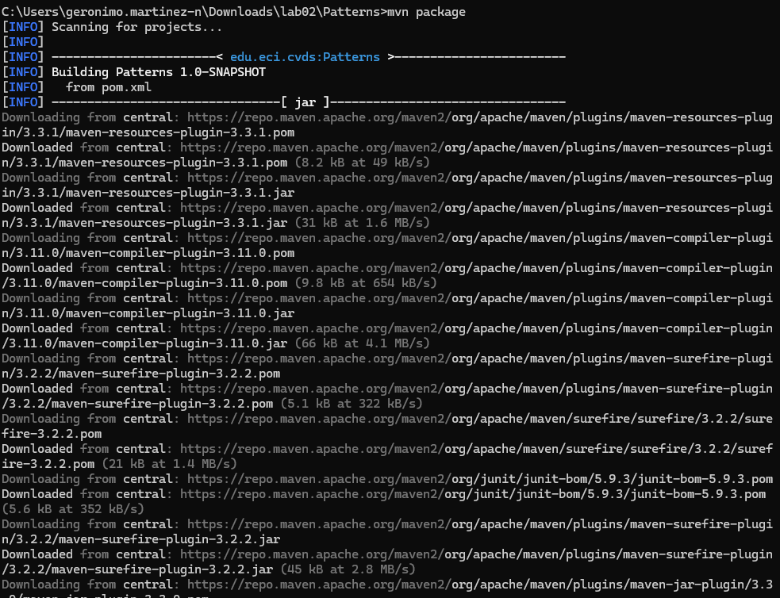
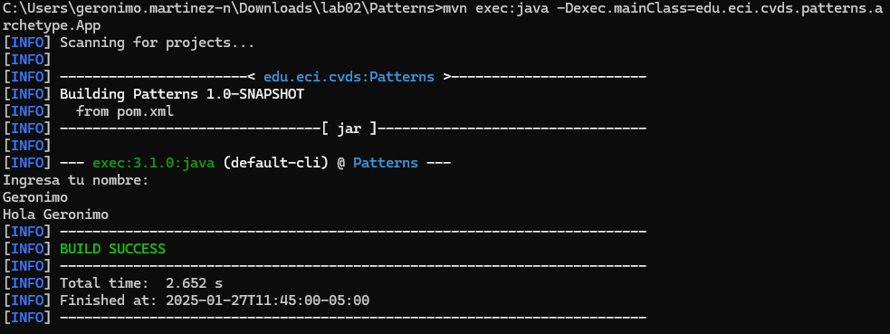
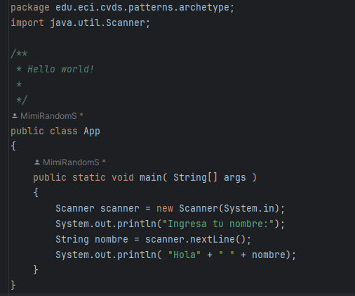
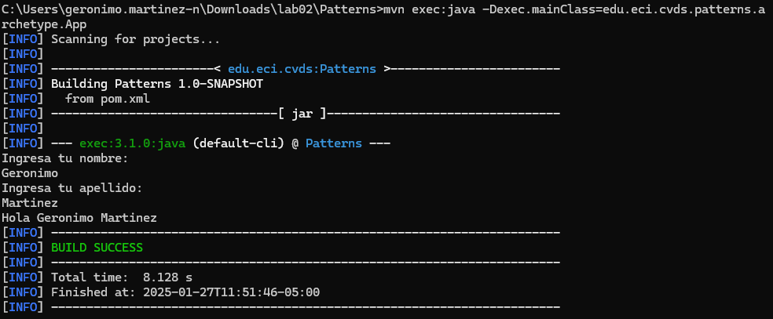
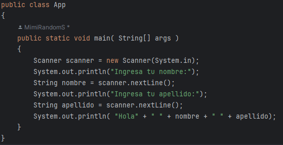
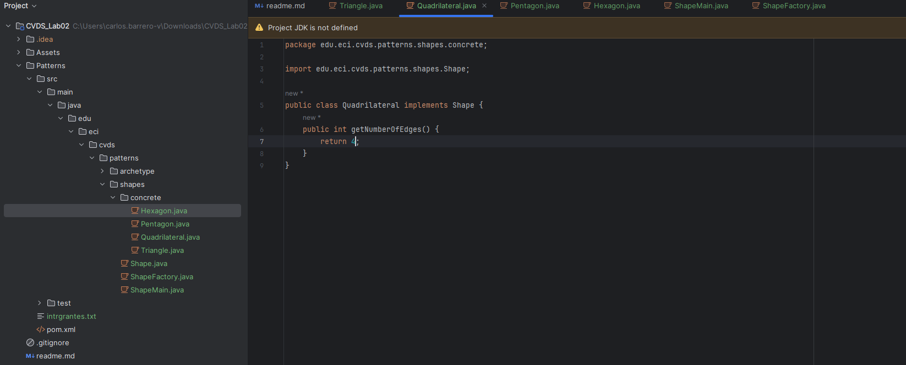
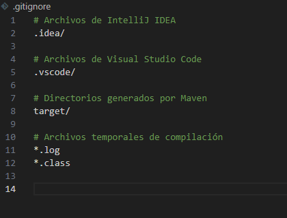

# LABORATORIO 2- PATTERNS
ESCUELA COLOMBIANA DE INGENIERÍA - CICLOS DE VIDA DE DESARROLLO DE SOFTWARE

---

## Integrantes
- Geronimo Martinez Nuñez.
- Carlos David Barrero Velasquez.

---
## LA HERRAMIENTA MAVEN
## Respuestas ✅

-¿Qué es Maven?

Maven es una herramienta de Apache software fundation para la gestión de proyectos Java, es una herramienta de automatización de proyectos de software, principalmente utilizada en el mundo de Java. Su propósito principal es facilitar la gestión de dependencias, la construcción del proyecto (compilación, pruebas, empaquetado, etc.) y la gestión de ciclos de vida del desarrollo.

- Cuál es su mayor utilidad

Maven se utiliza principalmente para gestionar dependencias, automatizar el proceso de construcción de proyectos y simplificar la gestión de versiones. Su mayor utilidad es hacer que el proceso de construcción de proyectos sea más fácil, consistente y automatizado, sin tener que configurar manualmente las tareas comunes en el ciclo de vida del desarrollo, como compilación, pruebas, empaquetado y despliegue.

- Fases de maven

Maven organiza la construcción del proyecto en una serie de fases dentro de un ciclo de vida.

```bash
Validate: Verifica que el proyecto esté correcto y todo esté configurado.
Compile: Compila el código fuente.
Test: Ejecuta las pruebas unitarias del proyecto.
Package: Empaqueta el código compilado en un formato adecuado, como un JAR, WAR, etc.
Verify: Realiza verificaciones adicionales sobre el paquete (ej. análisis estático).
Install: Instala el paquete en el repositorio local para su uso en otros proyectos.
Deploy: Despliega el paquete en un repositorio remoto.
```

- Ciclo de vida de la construcción

El ciclo de vida de construcción en Maven se refiere al conjunto de fases organizadas de manera que se ejecute el proceso completo de desarrollo del proyecto. Este ciclo cubre todo, desde la validación hasta el despliegue del proyecto. 

```bash
Default: Maneja la construcción, prueba y empaquetado del proyecto.
Clean: Elimina archivos generados previamente, garantizando que el proyecto esté limpio antes de una nueva construcción.
Site: Genera la documentación del proyecto.
```

- Para qué sirven los plugins

Los plugins de Maven son herramientas adicionales que se pueden usar para realizar tareas específicas dentro de las fases del ciclo de vida de construcción. Son extensiones que permiten ejecutar tareas como:

```bash
Compilación del código.
Ejecución de pruebas.
Creación de documentación.
Despliegue de artefactos.
```

- Qué es y para qué sirve el repositorio central de maven

El repositorio central de Maven es un repositorio en línea donde se almacenan las bibliotecas y dependencias de proyectos. Maven descarga automáticamente las dependencias desde este repositorio cuando se especifican en el archivo pom.xml de tu proyecto.
Su función principal es centralizar las dependencias más utilizadas y facilitar el acceso a ellas, ahorrando tiempo y esfuerzo al evitar la necesidad de descargarlas o configurarlas manualmente.

## EJERCICIO DE LAS FIGURAS
### CREAR UN PROYECTO CON MAVEN
## Respuestas ✅

Cómo ejecutar desde línea de comandos el objetivo "generate" del plugin "archetype"



Para ver el conjunto de archivos y directorios creados por el comando `mvn` ejecute el comando `tree`.



## AJUSTAR ALGUNAS CONFIGURACIONES EN EL PROYECTO
## Respuestas ✅
Edite el archivo `pom.xml`



## COMPILAR Y EJECUTAR
## Respuestas ✅
Para compilar ejecute el comando:
```sh
$ mvn package
```



- ¿Cuál es el objetivo del parámetro "package" y qué otros parámetros se podrían enviar al comando mvn?

El parámetro package en Maven hace referencia a una de las fases del ciclo de vida de Maven, y su objetivo es empaquetar el proyecto después de que haya sido compilado y probado. En concreto, la fase package toma el código compilado y genera un archivo empaquetado adecuado, como un archivo .jar, .war o .ear, dependiendo de la configuración del proyecto. Este archivo empaquetado es lo que se distribuiría o desplegaría para ser utilizado en otros entornos.

Otros parámetros que se pueden enviar al comando mvn:

```bash

clean:

Objetivo: Elimina los archivos generados en construcciones previas.
Uso: mvn clean
Resultado: Elimina el directorio target, que es donde Maven guarda los archivos generados (como el archivo .jar).

compile:

Objetivo: Compila el código fuente del proyecto.
Uso: mvn compile
Resultado: Compila los archivos .java en el directorio src/main/java y los coloca en el directorio target/classes.

test:

Objetivo: Ejecuta las pruebas unitarias.
Uso: mvn test
Resultado: Ejecuta las pruebas definidas en el proyecto (por ejemplo, con JUnit o TestNG).

install:

Objetivo: Instala el artefacto empaquetado en el repositorio local de Maven.
Uso: mvn install
Resultado: El archivo .jar, .war, etc., se copia al repositorio local de Maven para ser usado en otros proyectos en el mismo sistema.

deploy:

Objetivo: Despliega el artefacto a un repositorio remoto, para compartirlo con otros desarrolladores o proyectos.
Uso: mvn deploy
Resultado: Envía el artefacto empaquetado al repositorio remoto configurado (por ejemplo, Nexus o Artifactory).

site:

Objetivo: Genera documentación del proyecto.
Uso: mvn site
Resultado: Crea la documentación de tu proyecto, que puede incluir información sobre el código, pruebas, dependencias, etc.

validate:

Objetivo: Verifica que el proyecto esté correctamente configurado.
Uso: mvn validate
Resultado: Realiza un chequeo de la estructura del proyecto, asegurando que las configuraciones son correctas antes de continuar con la compilación o construcción.

clean install:

Objetivo: Realiza una limpieza del proyecto y luego lo empaqueta e instala.
Uso: mvn clean install
Resultado: Limpia el proyecto de archivos generados previamente y luego compila, prueba, empaqueta e instala el artefacto en el repositorio local.

verify:

Objetivo: Realiza verificaciones adicionales sobre el artefacto generado.
Uso: mvn verify
Resultado: Ejecución de pruebas o validaciones adicionales que comprueban la calidad del artefacto generado.

dependency:tree:

Objetivo: Muestra la jerarquía de dependencias del proyecto.
Uso: mvn dependency:tree
Resultado: Muestra las dependencias que tiene tu proyecto, lo cual es útil para diagnosticar problemas de versiones o dependencias transitivas.
```
---

Buscar cómo enviar parámetros al plugin "exec".

Ejecutar la clase desde línea de comandos enviando su nombre como parámetro y verificar la salida. Ej: Hello Pepito!




Verifique cómo enviar los parámetros de forma "compuesta" para que el saludo se realice con nombre y apellido.

Ejecutar nuevamente y verificar la salida en consola. Ej: Hello Pepito Perez!




## HACER EL ESQUELETO DE LA APLICACIÓN
## Respuestas ✅
Cree el paquete `edu.eci.cvds.patterns.shapes` y el paquete `edu.eci.cvds.patterns.shapes.concrete`.

Cree una interfaz llamada `Shape.java` en el directorio `src/main/java/edu/eci/cvds/patterns/shapes`.

Cree una enumeración llamada `RegularShapeType.java` en el directorio `src/main/java/edu/eci/cvds/patterns/shapes`.

En el directorio `src/main/java/edu/eci/cvds/patterns/shapes/concrete` cree las diferentes clases (Triangle, Quadrilateral, Pentagon, Hexagon), que implementen la interfaz creada y retornen el número correspondiente de vértices que tiene la figura. 

Cree el archivo `ShapeMain.java` en el directorio `src/main/java/edu/eci/cvds/patterns/shapes` con el metodo main.

Analice y asegúrese de entender cada una de las instrucciones que se encuentran en todas las clases que se crearon anteriormente. Cree el archivo `ShapeFactory.java` en el directorio `src/main/java/edu/eci/cvds/patterns/shapes` implementando el patrón fábrica.



¿Cuál fábrica hiciste? y ¿Cuál es mejor?

Nosotros realizamos el metodo simple factory, debido a que aunque sea simple el problema en cuestion no necesita un metodo complejo como los demas, por eso pensamos que el simple es el mejor, esto por como se ilustra en el bosquejo vemos que la fabrica crea instancias del objeto directamente y en nuestro problema solo tenemos una clase abstracta la cual nos da las clases de las figuras, si no entra un parametro valido manda error, si no ingresa nada pide una figura concreta y si la figura esta dentro de la fabrica pues esta manda la solucion la cual es mostar los lados que posee la figura.

- Simple Factory:


Ejecute múltiples veces la clase ShapeMain, usando el plugin exec de maven con los siguientes parámetros y verifique la salida en consola para cada una:

- Sin parámetros

.png)

- Parámetro: qwerty

.png)

- Parámetro: pentagon

.png)

- Parámetro: Hexagon

.png)

¿Cuál(es) de las anteriores instrucciones se ejecutan y funcionan correctamente y por qué?

Todas las instrucciones se ejecutan correctamente debido a que se esta validando los dos casos "atipicos" que seria que no entrara ningun parametro o que el parametro no fuera valido 
muestra los lados de las dos figuradas ingresadas y muestra los mensajes de "error" o aviso al no tener las figuras.

## ENTREGAR
## Respuestas ✅
Para qué sirve "gitignore" y configurelo en su proyecto para evitar adjuntar archivos que no son relevantes para el proyecto.




